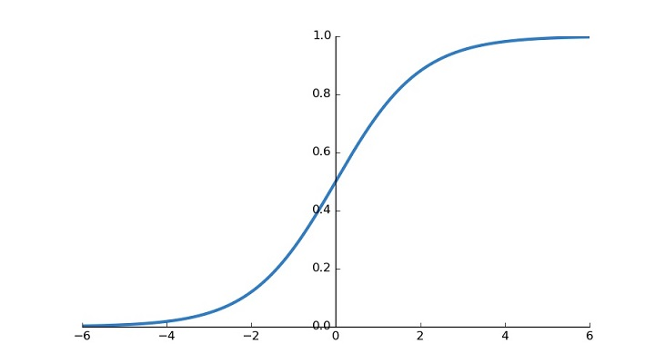
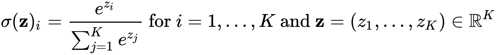
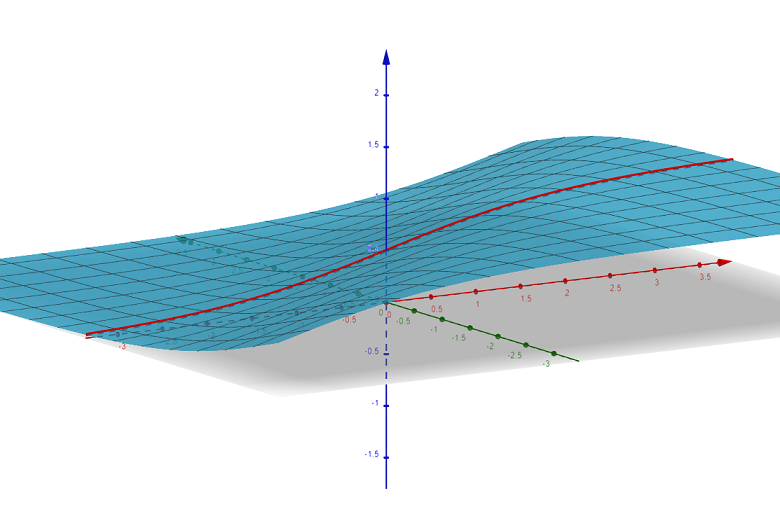

The **Softmax** function is used in many machine learning applications for multi-class classifications. Unlike the **Sigmoid** function, which takes one input and assigns to it a number (the probability) from 0 to 1 that it's a YES, the softmax function can take many inputs and assign probability for each one. Both can be used, for example, by **Logistic Regression** or **Neural Networks** - either for binary or multiclass classification.

Softmax got it's name from being a "soft" max (or better - argmax) function. I.e. unlike a regular argmax function, which will assign 1 to the maximum element in an array/list, and 0 for the rest, the softmax will assign a high value to the maximum number, but will keep some values for the rest, according to their value. As Wikipedia says it: it "normalizes it into a probability distribution".

In a sense, using one softmax is equivalent to using multiple sigmoids in a "One vs. All" manner, i.e. having C sigmoids (when C is the number of classes) and interpreting every sigmoid to be the probability of being in that specific class or not, and taking the max probability. One can view softmax as a generalization of the sigmoid and binary classification. A big advantage of using multiple binary classifications (i.e. Sigmoids) over a single multiclass classification (i.e. Softmax) - is that if your softmax is too large (e.g. if you are using a one-hot word embedding of a dictionary size of 10K or more) - it can be inefficient to train it. What you can do instead is take a small part of your training-set and use it to train only a small part of your sigmoids. This is the main idea behind [Negative Sampling](https://papers.nips.cc/paper/5021-distributed-representations-of-words-and-phrases-and-their-compositionality.pdf).

So Softmax and Sigmoids are similar in concept, but they are also different in practice. And since we are all practical people, let us dig a bit deeper.

## The Equations

Let's look at the sigmoid and the softmax functions:

### Sigmoid: 
{: .center-block :}



One of the benefits of sigmoid is that you can plot it, as it only depends on one input. You can see that for very small (negative) numbers it assigns a 0, and for a very large (positive) numbers it assigns a 1. For 0 it assigns 0.5, and in the middle, for values around 0, it is almost linear. One of the uses of the Sigmoid function (and other activations) in Neural Networks is to add non-linearity to the system. Without non-linearity, the whole neural network is reduced to a linear combination of the inputs, which makes it a very simple function, which probably cannot capture high complexities needed by (complex) data. 

### Softmax: 
{: .center-block :}



{: .center-block :}

In the image above, red axis is X, the green axis is Y, and the blue axis is the output of the softmax. You can see that for y=0 we get back the original sigmoid (outlined in red), but for a larger y, the sigmoid is "shifted" to the "right" of the x axis, so we need a bigger value of x to stay in the same output, and for a smaller y, it is shifted to the left, and a smaller value of x will suffice to stay in the same output value. 

You can play with this yourself in [GeoGebra](https://www.geogebra.org/3d/r3rsewaf). Just change the values of y and see the outline shifting.

Even though you cannot really draw a softmax function with more than 2 inputs, the idea is the same: imagine a sigmoid, who's middle (0 point) is shifted depending on how big or smalle are the other values of the input.  

One property of the softmax is that the actual values of the inputs are not important, only their distance between each other. I.e. you can shift the entire values by some constant and it wouldn't matter. 

## The Derivatives

### Sigmoid

The sigmoid derivative is pretty straight forward. Since the function only depends on one variable, the calculus is simple. You can check it out [here](https://math.stackexchange.com/a/1225116/342736). Here's the bottom line:

{: .center-block :}

I.e. the derivative of the sigmoid function, is the sigmoid times one minus the sigmoid. 

### Softmax

With softmax we have a somewhat harder life. Since there are multiple variables, this becomes a multivariate calculus problem. We can differntiate each one of the C (classes) softmax outputs with regards to (w.r.t.) every input. 

To simplify, let's imagine we have 3 inputs: x, y and z - and we wish to find it's derivatives. The result will be a 3x3 matrix, where the 1st row will be the derivative of the Softmax(x) w.r.t. x, y and z; the 2nd row will be the derivative of Softmax(y) w.r.t. x, y, z; etc.

Let's look at the derivative of Softmax(x) w.r.t. x:


So far so good - we got the exact same result as the sigmoid function.

But what is the derivative of a softmax w.r.t. to another input? i.e. dSoftmax(x) w.r.t. y or z? Let's look:


Turns out this is also what you get for dSoftmax(y) w.r.t. x. So our 3x3 matrix will be symmetric (which is always good, you know - real eigenvalues and orthonormal eigenvectors, etc.).

{: .center-block :}

And the same can be generalized any number of outputs. 

## The Code

If for whatever reason you ever want to implement these functions yourself in code, here is how to do it (in python, with numpy).

### Sigmoid

```python
def sigmoid(x):
    return 1 / (1 + np.exp(-x))
```

Pretty straight forward. We need numpy here for an efficient element-wise operations, and since our arrays will contain only the same type of values, which mean we can save on space (python regular arrays can contain different types together, but for this it needs to save information about the type of each element).

Our input to each function is a vector, who's rows are different examples/observations from our dataset.

Now, for the derivative. The question here is what you got at hand? If you have the output of the sigmoid, it's super easy:
```python
def sigmoid_derivative(a):
	# a being a vector of sigmoids
    return a * (1 - a)
```

If you only have the inputs, you can simply call the sigmoid:
```python
def sigmoid_derivative(z):
	# z being a vector of inputs of the sigmoid
    a = sigmoid(z)
    return a * (1 - a)
```

Most of the time, in a neural network architecture, you would want to chain these operations together, so you will get the derivative up to this point calculated in the backpropagation process. Now, you need to also cache either the input or output value of the forward pass.
```python
def sigmoid_back(da, z):
	# da being the derivative up to this point
    a = sigmoid(z)
    return da * a * (1 - a)
```

That was easy.

### Softmax

Softmax poses a challange. We are no longer dealing with a single vector where each observation has one input. Instead, each observation has C inputs. So we are moving from vectors to matrices! How fun. 

```python
def softmax(z):
	# z being a matrix whos rows are the observations, and columns the different input per observation
    e = np.exp(z)
    s = np.sum(e, axis=1, keepdims=True)
    return e/s
```

One thing many people do to avoid reaching NaN, is reduce the inputs by the max value of the inputs. Recall, this does not change the values of the softmax function. 
```python
def softmax(z):
    e = np.exp(z-np.max(z))
    s = np.sum(e, axis=1, keepdims=True)
    return e/s
```

Now for the tricky part. We are already in matrix world. But our derivative for each row/observation will give us back a matrix. This means we need to step forward from the world of matrices, to the world of... TENSORS! I.e. to matrices of shape (m, n, n) where m is the # of observations in the dataset, and n is the number of inputs to the softmax.

```python
def softmax_back(da, z):
    # z, da shapes - (m, n)
    m, n = z.shape
    p = softmax(z)
    # First we create for each example feature vector, it's outer product with itself
    # ( p1^2  p1*p2  p1*p3 .... )
    # ( p2*p1 p2^2   p2*p3 .... )
    # ( ...                     )
    tensor1 = np.einsum('ij,ik->ijk', p, p)  # (m, n, n)
    # Second we need to create an (n,n) identity of the feature vector
    # ( p1  0  0  ...  )
    # ( 0   p2 0  ...  )
    # ( ...            )
    tensor2 = np.einsum('ij,jk->ijk', p, np.eye(n, n))  # (m, n, n)
    # Then we need to subtract the first tensor from the second
    # ( p1 - p1^2   -p1*p2   -p1*p3  ... )
    # ( -p1*p2     p2 - p2^2   -p2*p3 ...)
    # ( ...                              )
    dSoftmax = tensor2 - tensor1
    # Finally, we multiply the dSoftmax (da/dz) by da (dL/da) to get the gradient w.r.t. Z
    dz = np.einsum('ijk,ik->ij', dSoftmax, da)  # (m, n)
    return dz
```

The 1st command _np.einsum('ij,ik->ijk', p, p)_ creates a tensor, where every element in the 1st axis, is associated with the outer product matrix. The 2nd command _np.einsum('ij,jk->ijk', p, np.eye(n, n))_ creates a tensor where every element in the 1st axis, is associated with an "identity" matrix that has the Softmax(x) value of the corresponding input in it's diagonals. Then we subtract the two to get the same matrix I've shown you above. 

dSoftmax is the Tensor of derivatives. But if you are interested in backpropagating it, you probably want to multiply it by the derivative up to this part, and are expecting a derivative w.r.t. to the inputs which is a matrix (m, n). This requires us to multiply, for each observation, the derivative matrix by the previous derivative vector - which will collapse the derivative matrix to a vector, and (doing so for every observtion) bring us back from the world of tensors to the world of plain matrices. 

That is what _np.einsum('ijk,ik->ij', dSoftmax, da)_ does. 

Most implementations will usually unite the softmax derivative part with the objective (loss/cost) function derivative - and use a hueristic for it. I.e. will get to dz immediately without jumping in and out of tensors world. For the regular softmax loss function, you will get _a - y_ where a is the final output of the softmax, and y is the actual value. 

That is much simpler, but it's also nice to know what goes on in every step ;-) .

Useful links:
1. [https://math.stackexchange.com/a/945918/342736](https://math.stackexchange.com/a/945918/342736)
2. [https://deepnotes.io/softmax-crossentropy](https://deepnotes.io/softmax-crossentropy)