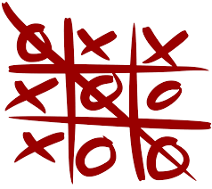
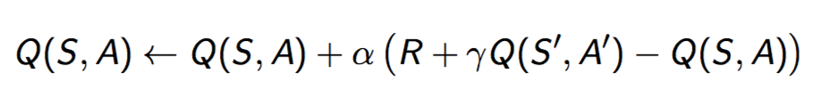
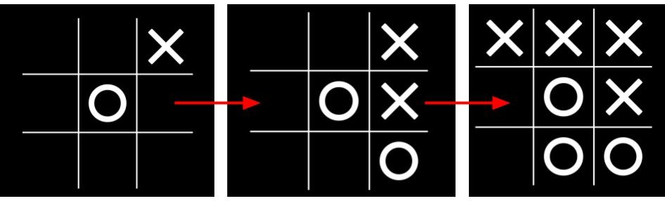
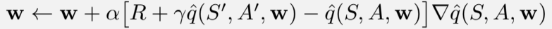
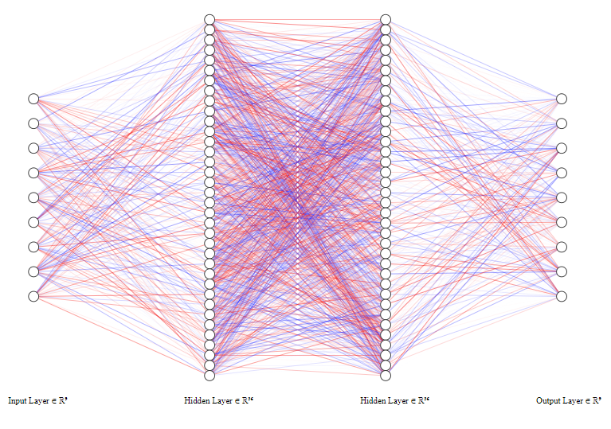
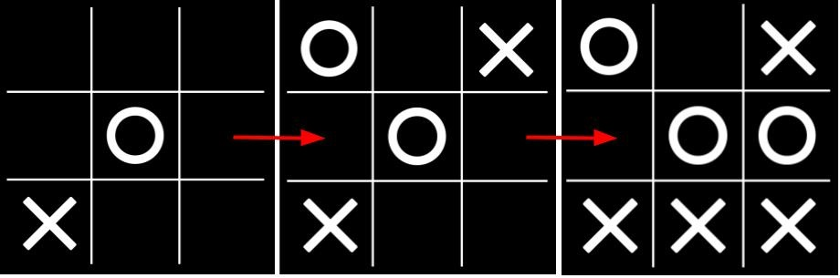

I recently completed a [Coursera specialization in Reinforcement Learning](https://www.coursera.org/specializations/reinforcement-learning) (RL) [which I highly recommed]. The idea behind it, in a nutshell, is to model an environment and an agent that interacts with each other. The agents processes the current state it is in, and, based on its learning model, chooses an action which it thinks can maximize its reward. This is somewhat of a different mind-set than Supervised Learning, where you assume you have inputs and corresponding labels or targets, and you are trying to learn a good mapping between the two. The main objective in RL is to learn a good value function for the different states and actions. i.e. given a state, what is the best action? This is a more dynamic type of problem, as each state depends on the previous state and action. Also, the rewards are not constant (they don't correct **every** step you make), and the consequences of an action can sometimes only be determined many steps forward.

I decided to put my skills into use and build an AI agent that can play Tic-Tac-Toe.

{: .center-block :} 

Links to jupyter notebooks:
[Exact Agent](https://github.com/MaverickMeerkat/Reinforcement-Learning/blob/master/TicTacToe/TicTacToe%20using%20SARSA%20-%20Part%201.ipynb), 
[NN Agent](https://github.com/MaverickMeerkat/Reinforcement-Learning/blob/master/TicTacToe/TicTacToe%20using%20SARSA%20-%20Part%202.ipynb), 
[Agents vs. Dummy](https://github.com/MaverickMeerkat/Reinforcement-Learning/blob/master/TicTacToe/TicTacToe%20using%20SARSA%20-%20part%203%20-%20Agent%20vs.%20Dummy%20Agent.ipynb)

I set out to model the environment. This was not so hard - there are basically 9 places that can contain value, and there are 3 possible values - X (-1), nothing (0) and O (+1). I decided to give a reward of +10 for the agent that wins, a reward of -1 for every step that doesn't end the game (in order to encourage fast winning), a reward of 0 for a tie, and a reward of -10 for the agent that loses. The environment also returns a mask of available spaces, used by the agent to decide which of its actions are available. 

Here's an excerpt of the main function - env_step:

```python
def env_step(self, agent_num, index):
    if self.terminal:
        print("Environment in terminal state, please restart.")
    
    row, col = self.transform_index(index)
    self.board[row, col] = agent_num
    
    if self.check_won(agent_num):
        reward = 10
        self.terminal = True
    elif self.check_tie():
        reward = 0
        self.terminal = True
    else:
        reward = -1
        
    self.reward_obs_term_mask = (reward, self.board.copy().reshape(9), self.terminal, self.get_mask())
    return self.reward_obs_term_mask
``` 

I then set out to model the agent. 

{: .center-block :}

All my approaches use an algorithm called (1-step) [SARSA](https://en.wikipedia.org/wiki/State%E2%80%93action%E2%80%93reward%E2%80%93state%E2%80%93action), which stands for: State, Action, Reward, (next) State, (next) Action. Basically, the agent utilizes all of these to update it's value function. The agent starts with an empty value function. Instead of playing a game to completion and only then updating it's value funcion, it uses every SARSA transition to update the function every step, bootstrap style. I won't go too much in depth over this. You can check either the coursera courses, or section 6.5 in [Sutton & Barto's book (2nd edition)](https://d3c33hcgiwev3.cloudfront.net/Ph9QFZnEEemRfw7JJ0OZYA_808e8e7d9a544e1eb31ad11069d45dc4_RLbook2018.pdf?Expires=1578700800&Signature=kknv~Fe2hgmHae7aID4u9P9BUwvcIQ2F5qaNopIiaOpjUeiqESW6W4xhnji1Yyf1dEgNg5NvaKCqAOtHPX65N4LFHM3cU-Zj3WQFRl1S~NM79uQSWijIvnCNAIvPVSLct6i5u7Ruc-IkWYDGoPFtyHUWq8iFH1WJBuOZTaw~QzQ_&Key-Pair-Id=APKAJLTNE6QMUY6HBC5A). The main equation of this algorithm is:

{: .center-block :}

Meaning, you update the value function Q for the current state S and action A, by taking a step (alpha) in the direction of the distance between the (bootstrapped) "real" (or better) value, and the old value. If alpha (the step size) is 1, you are basically replacing the old value with the new value. If it's less you are using a "moving" average. The new value is just the current reward + the value function for the new state and action. (Gamma is the discount factor. It is set for 1 in episodic scenarios, like Tic-Tac-Toe. It is a way to deal with infinite / continuous scenarios).

## Exact Agent

Ok, so my 1st (working) agent was a regular SARSA agent, which I called "Exact", because I had to store all of the different states. Theoratically, there are 9 squares on the board, and each can contain 3 values (empty, x, or O) , so there can be 3^9 =~ 20k different states. But most of these states are probably not feasible for a game. So it's much better to simply add every new encountered state to a dictionary. 

Here is the code for agent_step:

```python
def agent_step(self, reward, state, mask):
    # SARSA
    q = self.get_q(state, mask)
    action = self.policy(q, mask)
    q_s_ = q[action]
    q_s = self.states[str(self.last_state)][self.last_action]
    self.states[str(self.last_state)][self.last_action] += self.learning_step * (reward + q_s_ - q_s)

    self.last_state = state
    self.states[str(self.last_state)] = q
    self.last_action = action
    return action
```

I trained 2 agents to play against each other. After about 30k games, they reached a tie stand-off. No one could win over the other, the most they could hope for was a tie. 

I can hardly express the coolness feeling of this. I actually made a piece of software that can kick ass in Tic Tac Toe.

<!-- {: .center-block :} -->
<iframe src="https://giphy.com/embed/62PP2yEIAZF6g" width="480" height="273" frameBorder="0" class="giphy-embed" allowFullScreen></iframe><p><a href="https://giphy.com/gifs/swag-80s-sunglasses-62PP2yEIAZF6g"></a></p>

 I played a game against it, and sure enough - it knew what it was doing! Here's a visualization of how the game went, X is the ai agent, which started 1st. I'm O. I made a mistake on purpose on my 3rd move to see if it would take advantage and win, and it did.

{: .center-block :}

I played a few games against it, and it was good. Really good. 

In the end there were only about ~4500 states that it encountered during 30k games. Much less than the 20k upper bound. So this method was great, the only downside is that we had to save all the states that the evnironment could produce. For Tic-Tac-Toe this isn't bad, but for more complex scenarios it can become unfeasable. So can we do better?

## NN Agent

Function approximation is a way to deal with complexity. Instead of dealing with the incredibly complex, you simplify things - and in some cases it works well enough. The idea behind it in RL is that instead of saving all of the states, and creating an "Exact" agent that holds different action values per state, you create a function approximatot and have the agent only hold that. The agent get's a state, puts it in its function, and gets back action-values. This is a way of looking at functions as approximation, as useful abstraction of the too complex. The gaussian normal distribution is actually a good example of this - it was motivated by the need to approximate the binomial distribution ([source 1](http://onlinestatbook.com/2/normal_distribution/history_normal.html), [source 2](https://www.maa.org/sites/default/files/pdf/upload_library/22/Allendoerfer/stahl96.pdf)).

This variation of SARSA is called semi-gradient (1-step) SARSA. It's equation is:



Instead of updating a value function "action values", you update the weights of the value function approximator. You set up an objective function to be the mean-square-loss between the current values, and the "real" values. I say "real" because (again) you are not using the actual real values but rather a bootstrapped version of your last estimation with the newest information you recieved, i.e. the reward you obtained. You can read more about it in chapter 10 of Sutton & Barto's book.

I chose the function to be a Feed-Forward Neural-Network (FFNN) with a 9x36x36x9 architecture, where the 1st 9 units correspond to the state, and the last 9 units correspond to the action values. I used a sigmoid for the activations in the two hidden layers. I also played with ReLu's but since this is a relatively shallow NN, sigmoids work fine. I use a mean-squared-error because that is what is assumed by the semi-gradient SARSA to be the objective/loss function, and because it fits.

{: .center-block :}

I set up the network using Keras. It's really simple:

```python
class SimpleKerasNN():
    def __init__(self, layer_sizes, activation_type="sigmoid", lr=0.009):
        self.layer_sizes = layer_sizes
         
        self.model = Sequential()
        self.model.add(Dense(layer_sizes[1], input_shape=(layer_sizes[0],), activation=activation_type))
        for i in range(2, len(layer_sizes)):
            self.model.add(Dense(layer_sizes[i]))
        
        self.optimizer = optimizers.Adam(lr=lr)
        self.model.compile(optimizer=self.optimizer,
                    loss='mean_squared_error',
                    metrics=['accuracy'])

    def predict(self, input):
        return self.model.predict(input)

    def train(self, input, target):
        self.model.fit(input, target, batch_size=1, verbose=0)
```

The final layer has no activation. Instead I pass it through a [softmax](https://themaverickmeerkat.com/2019-10-23-Softmax/) function, I then mask out the non available options, divide by the remaining sum to get the adjusted probabilities, and I then sample from the availble actions given the probabilities. Basically - if an action is **REALLYYYY** good, the agent will choose it almost always. If it's only *somewhat* good, it will choose it more requently than others, but will continue to explore. Making the agent non-deterministic allows it to continue to explore. Giving it a tau / temperature parameter to adjust the softmax can tell it how much to explore and how much to go for the "greedy" (currently best known) action. 

Here is the code for agent_step and policy:

```python
def policy(self, state, mask):
    action_values = self.network.predict(state)
    probs = softmax(action_values, self.tau) 
    probs *= mask
    probs /= probs.sum()
    action = self.rand_generator.choice(self.num_actions, p=probs.squeeze())
    return action   

def agent_step(self, reward, state, mask):
    # SARSA
    state = state.reshape(1, -1)
    action = self.policy(state, mask)
    target = self.network.predict(self.last_state)[0]
    correct = reward + self.discount * self.network.predict(state)[0][action]
    target[self.last_action] = correct
    self.network.train(self.last_state, target.reshape(1,-1))
    
    self.last_state = state
    self.last_action = action
    return action
```

The update is done by the Keras train method. I just pass the (bootstrapped) "real" target value of the action values, and it will take care of the rest.

I trained two agents to play against each other. After 50k games they still didn't reach a tie stand-off. But the percentage of ties was slowly increasing. 

I decided to play a game against the agent. And sure enough - it too knew what it was doing. 

{: .center-block :}

## Face Off!

I decided to let the 2 different agents, the Exact and the NN (function approximation) play against each other. The results were quite clear - the Exact agent p@wn3d the NN agent. Though the NN agent improved. I ran 3 x 10k games. In the last 10k, the Exact agent won only 1721 games. The rest were tied. The NN never won a game. Still, tie-ing with the exact agent for 83% of the games is impressive.

I also let both agents play against a dummy agent (an agent that randomly chooses among available squares). The NN agent did 10x times better than the dummy agent. Winning 8696 games, while the Dummy agent only won 815 games. The Exact agent, however, won 9187 games, and didn't allow the Dummy agent to win even 1 game - all the rest of the games were tied. This clearly shows the vast superiority of the exact agent over the NN agent.

## Conclusion

It took 50k games to reach a less optimal level than the exact model. The NN model used ~ 2k weights, while the exact solution had to keep ~ 4.5k states x9 action values per state. But it did take much more time to train, and its performance was weaker than the exact agent. 

### Some more exploring

I [tried](https://github.com/MaverickMeerkat/Reinforcement-Learning/blob/master/TicTacToe/TicTacToe%20using%20SARSA%20-%20part%202.5.ipynb) using a NN of 9x12x12x9 - but couldn't get good results with it. I [also](https://github.com/MaverickMeerkat/Reinforcement-Learning/blob/master/TicTacToe/TicTacToe%20using%20SARSA%20-%20part%202.75%20-%20Convolution%20NN.ipynb) played around with a convolution architecture, but again to no avail. 