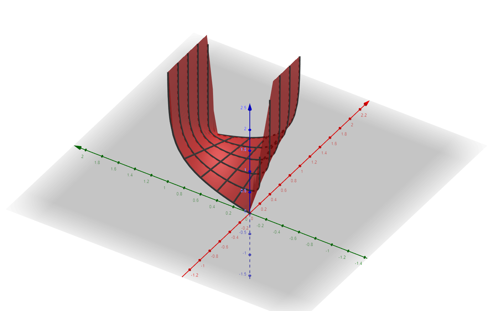
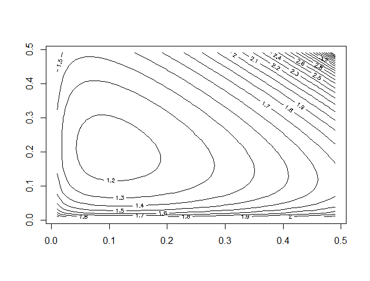
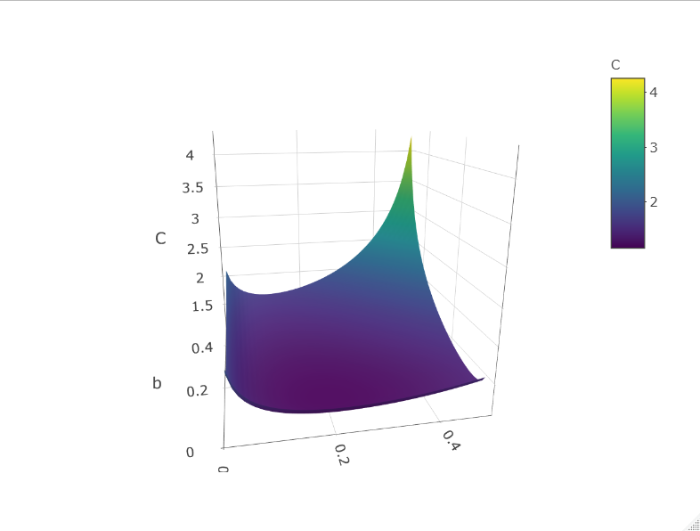

Cross-Entropy can be thought of as a measure of how much one distribution differs from a 2nd distribution, which is the ground truth. It is one of the two terms in the KL-Divergence, which is also a sort-of measure of (non-symmetric) distance between two distribution, the other term being the ground-truth entropy. Here is the KL for the discrete case:

$$D_{KL}(P||Q) = - \sum_x P(x)\log{Q(x)} + \sum_x P(x)\log{P(x)} = H(P,Q) - H(P)
$$

$$H(P)$$ being the entropy, and $$H(P,Q)$$ being the cross-entropy.

But in machine learning, the data distribution is usually given, so you cannot change the data entropy. It is a constant. Instead you focus on the cross entropy term, trying to minimize it as much as possible. So let's focus on this cross entropy term:

$$ - \sum_x P(x)\log{Q(x)} $$

In classification problems the distributions are discrete, and often there are cases where the ground truth, the "real" labels, are 1-hot vectors. i.e. $$P(x)$$ is 1 for a specific value, and 0 for all the rest. This reduces the cross entropy to (switching to y instead of x, which is usually denoting labels):

$$ -\log{Q(y_i)} $$

Where i is the index of the correct label. If $$Q(x_i)=1$$ we get 0, but as it goes further from 1 and more into 0, the value grows up to infinity. We can think of the cross entropy as a objective/loss function, which we want to minimize. 

It can also be that the classification is binary - e.g. "SPAM" and "NOT-SPAM". In that case we can write the complete cross entropy of a single observation as follows:

$$ -y_i \log{\hat y_i} - (1-y_i)\log{1-\hat y_i}$$

Here $$\hat y_i$$ is the predicted value, taken from the distribution we control, i.e. it is $$Q(y_i)$$. Notice that if $$y_i=1$$, the 2nd term zeros, and we get the same expression as before. If $$y_i=0$$ then the first term zeros, and now we want that $$\hat y_i$$ will be as close as possible to 0. 

This is called Binary-Cross-Entropy, and is often introduced in intro to machine learning, as it's the most simple form to understand. 

You can define this loss with 2 graphs: 1 for when you have a positive sample, and one when you have a negative sample.

{: .center-block :}

But the ground-truth may not be a 1-hot vector. Cross-Entropy can capture the distance for any valid distribution of $$y_i$$, meaning for any $$y_i\in[0,1]$$. You can check a 3D graph I made in GeoGebra [here](https://www.geogebra.org/3d/s8hn5fkd).

{: .center-block :}

You can see that the values at $$y=1$$ and at $$y=0$$ are the same as before, but in between we get some interpolation between the two. Nevertheless this indeed captures distance between $$y$$ and $$\hat y$$, but now the minimal value $$y=\hat y$$ will not be 0, but something small. If you play around with this function, you can see it doesn't fit for values outside of the $$[0,1]$$ interval. 

The general cross-entropy however is a generalization to more than just 2 values (and even more than just discrete set of values). Here is a contour plot of the 2 first values in a 3 values distribution. The real distribution ($$y_i$$) was (0.1, 0.2, 0.7). And I calculated the cross-entropy for different values of the first 2 values. You can see that indeed the minimal score is around (0.1,0.2):

{: .center-block :}

Or if you prefer a 3D graph:

{: .center-block :}

So in conclusion cross entropy is an important meaure of distance between any 2 distributions, they are a very popular choice for discrete classification problems, where the ground truth labels are 1-hot vectors, and are even more simple and useful in binary classifications, where the loss can be viewed in a single 2D graph. 

***
If you’re looking for statistical consultation, work on interesting projects, or training workshop, visit my website https://meerkatstatistics.com/  or contact me directly at david@meerkatstatistics.com 