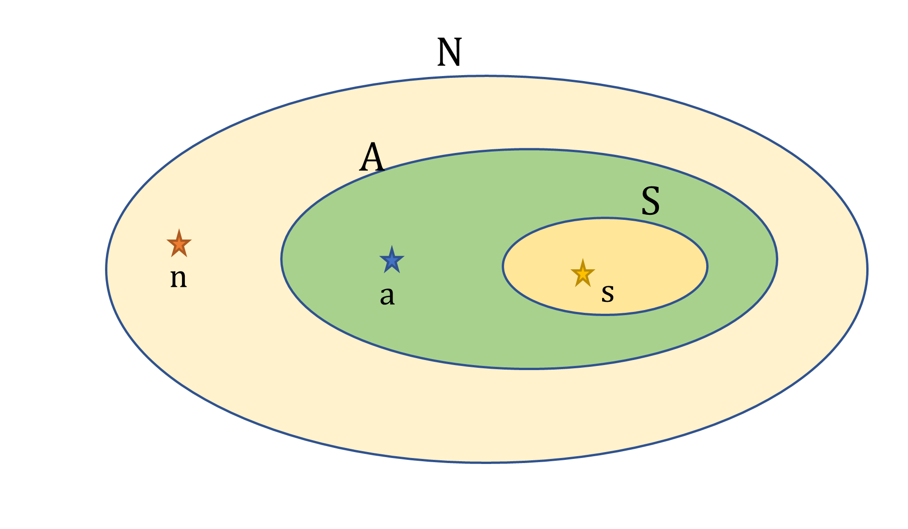

I always get confused between necessary and sufficient conditions. 
So here's a small picture to remind myself:

{: .center-block :}

Suppose we care about condition A. It is very important to us. But there is condition N which is a superset of condition A. And there is condition S which is a subset of condition A. 

N is **necessary** for A. No element in A, is not also a part of N. 

S is **sufficient** for A. All elements in S must be also in A.

N is NOT **sufficient** for A. There are elements in N which are not in A (e.g. n). 

S is NOT **necessary** for A. There are elements in A which are not in S (e.g. a). 

If I want to prove that something is IN A, it might be easier to prove that it's in S, and as S is sufficient, I'm done. If I want to prove that something is NOT IN A, it might be easier to prove that it's not in N, and so it doesn't fulfill the necessary condition. 

***
If you’re looking for statistical consultation, work on interesting projects, or training workshop, visit my website https://meerkatstatistics.com/  or contact me directly at david@meerkatstatistics.com 